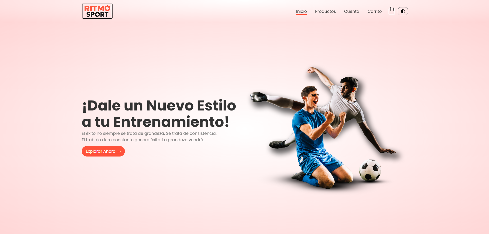
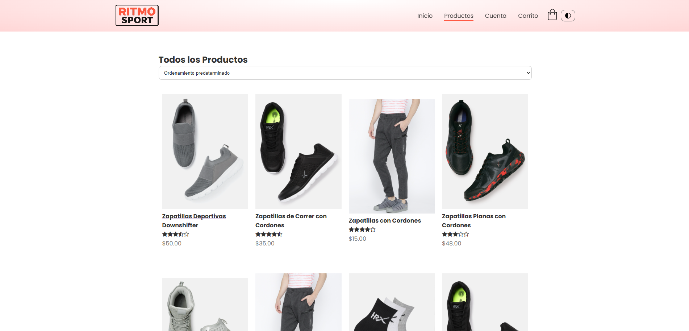
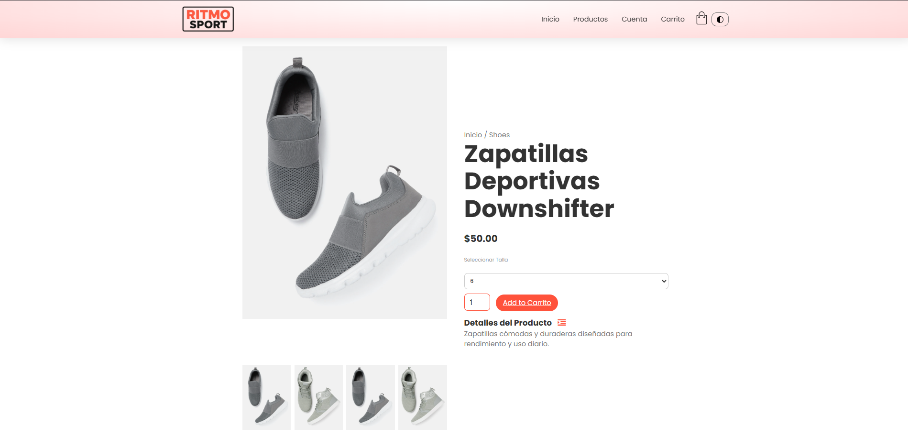
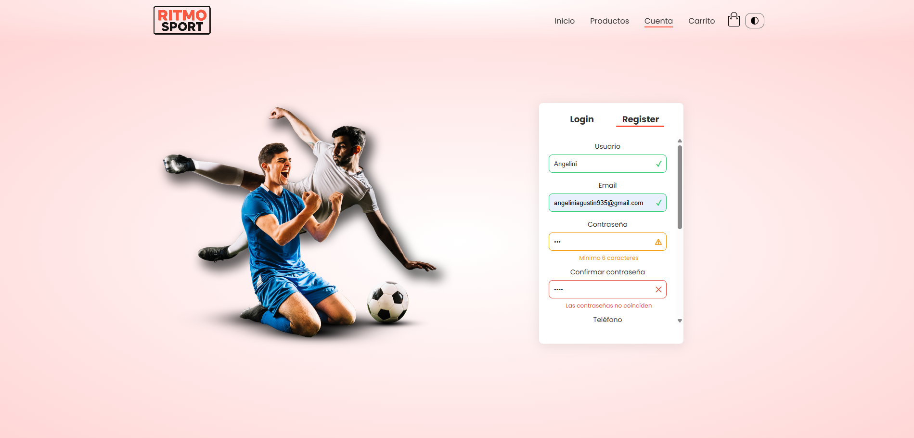
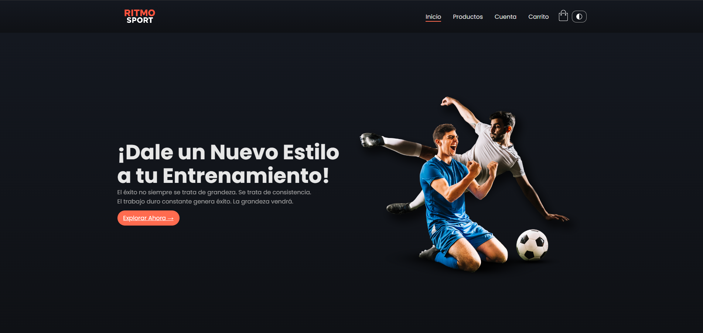

# 🏃‍♂️ Ritmo Sport - Tienda Deportiva Online

¡Bienvenido a **Ritmo Sport**! Esta es una tienda en línea completa dedicada a la venta de productos deportivos, desde zapatillas de running hasta accesorios para entrenamiento. El proyecto combina un diseño moderno y responsive con funcionalidades avanzadas de JavaScript para crear una experiencia de compra excepcional.

## 📋 Descripción del Proyecto

Ritmo Sport es una plataforma de e-commerce especializada en artículos deportivos que ofrece:
- **Catálogo completo** de productos con imágenes de alta calidad
- **Sistema de carrito de compras** intuitivo
- **Formulario de registro** con validación avanzada
- **Modo oscuro/claro** para comodidad visual
- **Diseño totalmente responsive** que se adapta a cualquier dispositivo
- **Animaciones suaves** y transiciones elegantes

El sitio está diseñado pensando en la experiencia del usuario, con navegación intuitiva y un proceso de compra simplificado.

## 🛠️ Tecnologías Utilizadas

### Frontend
- **HTML5** - Estructura semántica y accesible
- **CSS3** - Estilos modernos con Flexbox, Grid y animaciones
- **JavaScript (ES6+)** - Interactividad y funcionalidades dinámicas

### Librerías y Frameworks
- **Font Awesome** - Iconos vectoriales para una mejor UI
- **Google Fonts (Poppins)** - Tipografía moderna y legible

### Herramientas de Desarrollo
- **Visual Studio Code** - Editor de código
- **Git** - Control de versiones
- **JSONPlaceholder** - API mock para simular envíos de formularios

## 🚀 Cómo Ejecutar el Proyecto

### Opción 1: Ejecutar Localmente (Más Fácil)
1. **Descarga el proyecto** desde el repositorio
2. **Extrae los archivos** en una carpeta de tu computadora
3. **Abre el archivo `index.html`** con tu navegador web favorito
4. ¡Listo! El sitio funcionará inmediatamente sin necesidad de servidor

### Opción 2: Usar un Servidor Local
Si prefieres usar un servidor local (recomendado para desarrollo):

```bash
# Si tienes Python instalado
python -m http.server 8000

# O con Node.js
npx http-server

# O con PHP
php -S localhost:8000
```

Luego abre `http://localhost:8000` en tu navegador.

## Capturas de Pantalla

### Página Principal

*Vista de la página de inicio con hero section, categorías destacadas y productos*

### Catálogo de Productos

*Vista del catálogo completo con filtros y productos organizados*

### Detalles del Producto

*Vista detallada de producto con galería de imágenes y opciones de compra*

### Formulario de Registro

*Formulario avanzado con validación en tiempo real y feedback visual*

### Modo Oscuro

*Vista del sitio en modo oscuro para mayor comodidad visual*

### Vista Mobile
  
*Vista responsive en dispositivos móviles*

## ✨ Funcionalidades Implementadas

### Página Principal
- **Hero section** con llamada a la acción
- **Categorías destacadas** con imágenes atractivas
- **Productos más vendidos** y recientes
- **Testimonios de clientes** con reseñas
- **Sección de ofertas especiales**

### Catálogo de Productos
- **Vista de cuadrícula** para productos
- **Paginación** para navegación fácil
- **Filtros de ordenamiento** (precio, popularidad, calificación)
- **Enlaces a detalles** de cada producto

### Detalles del Producto
- **Galería de imágenes** con zoom
- **Información completa** del producto
- **Selector de tallas** y cantidades
- **Botón de agregar al carrito**
- **Productos relacionados**

### Carrito de Compras
- **Vista de tabla** con productos seleccionados
- **Cálculo automático** de subtotales e impuestos
- **Botones de eliminación** individual
- **Resumen de compra** final

### Sistema de Cuentas
- **Formulario de login** simple
- **Registro avanzado** con múltiples campos
- **Validación en tiempo real** de todos los campos
- **Feedback visual** con iconos de estado
- **Simulación de envío** a API

### Interfaz de Usuario
- **Navegación responsive** con menú hamburguesa
- **Modo oscuro/claro** con persistencia
- **Animaciones suaves** al hacer scroll
- **Transiciones elegantes** entre estados
- **Iconos intuitivos** en toda la interfaz

## Funcionalidades Extra Implementadas

### Validación Avanzada del Formulario
- **Validación en tiempo real** mientras escribes
- **Mensajes contextuales** específicos para cada error
- **Iconos de estado** (✓ éxito, ✕ error, ⚠ advertencia)
- **Validación cruzada** (confirmación de contraseña)
- **Formato inteligente** para emails y teléfonos

### Experiencia Mobile-First
- **Diseño completamente responsive**
- **4 breakpoints** optimizados (móvil, tablet, laptop, desktop)
- **Menú adaptativo** que se convierte en hamburguesa
- **Imágenes optimizadas** con lazy loading

### Sistema de Temas
- **Modo oscuro** completo con gradientes
- **Persistencia automática** de la preferencia del usuario
- **Transiciones suaves** entre modos
- **Adaptación de colores** en todos los componentes

### Animaciones y Micro-interacciones
- **Animaciones CSS** en el hero section
- **Intersection Observer** para aparición de tarjetas
- **Transiciones suaves** en botones y estados
- **Scroll automático** a mensajes de feedback

### Simulación de API
- **Fetch API** para envío de formularios
- **Manejo de errores** realista
- **Estados de carga** con feedback visual
- **Respuestas simuladas** de servidor

## 📂 Estructura del Proyecto

```
shoe_store-main/
├── index.html                 # Página principal
├── products.html             # Catálogo de productos
├── products-details.html     # Detalles de producto
├── cart.html                 # Carrito de compras
├── account.html              # Sistema de cuentas
├── style.css                 # Estilos principales
├── js/
│   ├── app.js               # Funcionalidades generales
│   └── form.js              # Validación de formularios
└── images/                   # Imágenes del sitio
    ├── logo.png
    ├── product-*.jpg
    └── favicon.ico
```

## 🎯 Características Técnicas

- **HTML5 Semántico**: Uso correcto de etiquetas semánticas
- **CSS Moderno**: Flexbox, Grid, variables CSS, animaciones
- **JavaScript Modular**: Código organizado y reutilizable
- **Accesibilidad**: Labels, ARIA, navegación por teclado
- **Optimización**: Imágenes lazy, compresión, performance
- **Compatibilidad**: Funciona en todos los navegadores modernos

---

**¡Gracias por visitar Ritmo Sport!** Esperamos que disfrutes explorando nuestra tienda de productos deportivos. Si tienes sugerencias para mejorar la experiencia, ¡no dudes en compartirlas! 🏃‍♀️💨

